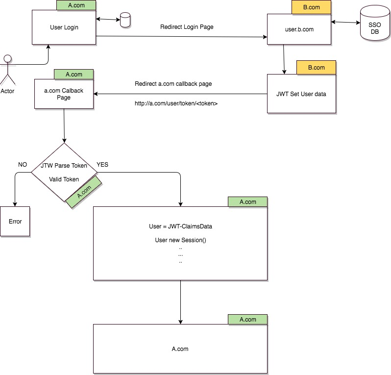

# go-jwt

Different domain or same domain jwt token examples

### Dependency:
    go get github.com/codegangsta/martini
    go get github.com/codegangsta/martini-contrib/render
    go get github.com/robbert229/jwt

### Start the web server:

    go run jwt.go

[http://localhost:5000/auth/arslan/topcu](http://localhost:5000/auth/arslan/topcu)

### Token Check:

    http://localhost:5000/token/<token>

### Cross Domain cors settings for martini:
    
[https://github.com/rs/cors/blob/master/examples/martini/server.go](https://github.com/rs/cors/blob/master/examples/martini/server.go)

